<h1 align="center">Hi 👋, I'm Thushan</h1>

<h3 align="center">Data Science • Business Intelligence • Data Analytics • Machine Learning</h3>

<p align="center">
  🎓 <strong>BSc (Hons) in Data Science</strong> · Sabaragamuwa University of Sri Lanka 🇱🇰<br>
  <strong>Expected Graduation: 2028</strong> · Open to Data Science, BI &amp; Data Analytics Internships
</p>

<p align="center">
  <a href="https://github.com/TN-ThushaN">
    
  </a>
  <a href="https://github.com/TN-ThushaN?tab=followers">
    
  </a>
  <a href="https://www.linkedin.com/in/tn-thushan-b6777a326">
    
  </a>
</p>

<p align="center">
  
</p>

<p align="center">
  
</p>

<p align="center">
  <a href="#-about-me">About</a> •
  <a href="#-my-tech-universe">Tech Stack</a> •
  <a href="#-featured-projects">Projects</a> •
  <a href="#-github-analytics">GitHub Stats</a> •
  <a href="#-lets-connect">Contact</a>
</p>

---

## 👨‍💻 About Me

I'm a **Data Science undergraduate** passionate about using **Data Science, Business Intelligence, and Data Analytics** to solve real-world problems. I enjoy cleaning and exploring data, discovering patterns, building predictive models, and transforming findings into clear dashboards and actionable business insights.

- 📊 **Career focus:** Business Intelligence Analyst / Data Scientist / Data Analyst
- 🧰 **Analytics toolkit:** Power BI, Excel, SQL, Python, Power Query, DAX, and data visualization
- 🧪 **Data Science skills:** Data preprocessing, exploratory data analysis (EDA), statistics, feature engineering, machine learning, and model evaluation
- 🎯 **What I enjoy:** Data cleaning, reporting, dashboard design, KPI tracking, forecasting, and data storytelling
- 🧠 **Related interests:** Natural Language Processing (NLP), predictive analytics, and time-series analysis
- 🗄️ **Project experience:** Database-backed web systems, MySQL, and MongoDB
- 🤝 **Opportunities:** Data Science, BI, and Data Analytics internships

### 🎯 Career Focus

**Data Science + Business Intelligence + Data Analytics → Insights → Data-Driven Decision Making**

> **My goal:** Turn raw data into reliable predictions, understandable insights, and better business decisions.

---

# 🧠 My Tech Universe

### 📊 Business Intelligence & Analytics

<p align="center">
  
  
  
  
  
  
</p>

### 💻 Languages

<p align="center">
  
</p>

### 🤖 Data Science, Machine Learning & Statistics

<p align="center">
  
  
  
  
  
  
  
  
</p>

### 🌐 Web Development

<p align="center">
  
</p>

### 🗄️ Databases

<p align="center">
  
</p>

### ⚙️ Development Tools

<p align="center">
  
</p>

---

# 🚀 Featured Projects

<p align="center"><strong>Business intelligence dashboards, data science, machine learning, NLP, forecasting, and real-world applications</strong></p>

<table>
  <tr>
    <td width="50%" valign="top">
      <h3>🇱🇰 Sri Lanka Inflation Dashboard</h3>
      <p><strong>Power BI • CCPI &amp; NCPI • Data Visualization</strong></p>
      <ul>
        <li>Analyze monthly inflation trends (2020–2025)</li>
        <li>Compare overall, food, and non-food inflation</li>
        <li>Explore interactive reports and year filters</li>
        <li>Uses official Sri Lankan DCS statistics</li>
      </ul>
      <p><em>Academic dashboard · Repository link to be added</em></p>
    </td>
    <td width="50%" valign="top">
      <h3>🛍️ Retail Sales &amp; Profitability</h3>
      <p><strong>SQL • Python • Analytics Dashboard</strong></p>
      <ul>
        <li>Analyze revenue and profit margins</li>
        <li>Compare categories and regional performance</li>
        <li>Present business KPIs and sales patterns</li>
        <li>Synthetic demonstration dataset</li>
      </ul>
      <p><em>BI portfolio project · Repository link to be added</em></p>
    </td>
  </tr>
  <tr>
    <td width="50%" valign="top">
      <h3>👥 HR Workforce Insights</h3>
      <p><strong>SQL • Python • HR Analytics</strong></p>
      <ul>
        <li>Analyze workforce composition</li>
        <li>Review hiring and employee exit patterns</li>
        <li>Explore satisfaction and workforce KPIs</li>
        <li>Synthetic demonstration dataset</li>
      </ul>
      <p><em>BI portfolio project · Repository link to be added</em></p>
    </td>
    <td width="50%" valign="top">
      <h3>🎧 Customer Support Analytics</h3>
      <p><strong>SQL • Python • Operations Reporting</strong></p>
      <ul>
        <li>Explore support ticket volumes and trends</li>
        <li>Track resolution time and service KPIs</li>
        <li>Assess operational performance</li>
        <li>Synthetic demonstration dataset</li>
      </ul>
      <p><em>BI portfolio project · Repository link to be added</em></p>
    </td>
  </tr>
  <tr>
    <td width="50%" valign="top">
      <h3>📘 BookHub</h3>
      <p><strong>Library Management System • PHP • MySQL</strong></p>
      <p>🔗 <a href="https://github.com/TN-ThushaN/bookhub"><strong>View GitHub Repository ↗</strong></a></p>
      <ul>
        <li>Role-based Admin and User dashboards</li>
        <li>Borrowing and return management</li>
        <li>Notifications and transaction history</li>
        <li>Reports and database operations</li>
      </ul>
    </td>
    <td width="50%" valign="top">
      <h3>🧠 Fake News Detection</h3>
      <p><strong>Data Science • Machine Learning • NLP • Flask</strong></p>
      <p>🔗 <a href="https://github.com/TN-ThushaN/Fake-News-Detection"><strong>View GitHub Repository ↗</strong></a></p>
      <ul>
        <li>Text cleaning and NLP preprocessing</li>
        <li>TF-IDF feature extraction</li>
        <li>Logistic Regression classification</li>
        <li>Flask prediction interface</li>
      </ul>
    </td>
  </tr>
  <tr>
    <td width="50%" valign="top">
      <h3>🎓 Student Feedback Analysis</h3>
      <p><strong>Data Science • Sentiment Analysis • NLP • Machine Learning</strong></p>
      <p>🔗 <a href="https://github.com/TN-ThushaN/NLP_Student_Feedback"><strong>View GitHub Repository ↗</strong></a></p>
      <ul>
        <li>Collect and preprocess student feedback</li>
        <li>Apply NLP-based sentiment classification</li>
        <li>Classify positive, neutral, and negative text</li>
        <li>Evaluate model performance</li>
      </ul>
    </td>
    <td width="50%" valign="top">
      <h3>💰 Expense Tracker</h3>
      <p><strong>Personal Finance • PHP • MySQL • Chart.js</strong></p>
      <p>🔗 <a href="https://github.com/TN-ThushaN/Expense-Tracker-App"><strong>View GitHub Repository ↗</strong></a></p>
      <ul>
        <li>Track income and expenses by category</li>
        <li>Manage monthly budgets</li>
        <li>Explore financial summaries and charts</li>
        <li>View spending analytics</li>
      </ul>
    </td>
  </tr>
  <tr>
    <td width="50%" valign="top">
      <h3>🌐 Personal Portfolio</h3>
      <p><strong>Responsive Web Design • HTML • CSS • JavaScript</strong></p>
      <p>🔗 <a href="https://github.com/TN-ThushaN/thushan-portfolio"><strong>View GitHub Repository ↗</strong></a></p>
      <ul>
        <li>Project and technical skills showcase</li>
        <li>Responsive, mobile-friendly layout</li>
        <li>Interactive interface elements</li>
        <li>Portfolio presentation</li>
      </ul>
    </td>
    <td width="50%" valign="top">
      <h3>🚲 Bike Sharing Demand Forecasting</h3>
      <p><strong>Data Science • Time Series • Python • Regression</strong></p>
      <ul>
        <li>Explore historical demand patterns</li>
        <li>Engineer time and lag features</li>
        <li>Train supervised regression models</li>
        <li>Evaluate MAE, RMSE, and R²</li>
      </ul>
      <p><em>Academic capstone · Repository link to be added</em></p>
    </td>
  </tr>
</table>

<details>
  <summary><strong>🔬 More Data Science Projects &amp; Academic Coursework</strong></summary>

  - 🆘 **AidBridge:** Disaster relief, donor/NGO/victim roles, allocations, and reporting
  - 🏠 **King County House Prices:** OLS, log-linear regression, LASSO, and diagnostic analysis
  - 🏡 **Ames House Prices (Kaggle):** Feature preparation, prediction, and submission workflow
  - 🌧️ **Seasonal Rainfall Study:** Probability distributions and monsoon comparisons
  - 📚 **Book Data Scraping & EDA:** Extract, clean, and visualize book prices and ratings
  - 🗃️ **Data Warehousing:** ETL, OLAP, dimensional modeling, star and snowflake schemas
  - 🔗 **XML/XPath/XSLT:** Data structuring, navigation, and transformation
  - 🌐 **Parallel & Distributed Computing:** System architectures and comparisons
  - 🕸️ **Graph Theory:** Random graphs and graph properties
  - 📈 **Scientific Visualization:** Evaluation of graphics in computing research
</details>

---

# 🔬 My Data Science & Analytics Workflow

```text
       🎯 DEFINE THE PROBLEM
                 ↓
          🗂️ COLLECT DATA
                 ↓
        🧹 CLEAN & VALIDATE
                 ↓
         🔍 EXPLORE DATA
                 ↓
          📈 FIND PATTERNS
                 ↓
        ┌────────┴────────┐
        ↓                 ↓
   📊 BI & REPORTING   🤖 DATA SCIENCE
   Define KPIs         Engineer features
   Build dashboards    Train & evaluate models
        ↓                 ↓
        └────────┬────────┘
                 ↓
       💡 COMMUNICATE INSIGHTS
                 ↓
       🚀 SUPPORT DECISIONS
```

*My projects combine descriptive analytics, business reporting, and predictive modeling when appropriate.*

---

# 📊 GitHub Analytics

<p align="center">
  
  
</p>

<p align="center">
  
</p>

---

# 📈 Contribution Activity

<!-- BEGIN ACTIVITY-GRAPH -->
<p align="center">
  
</p>
<!-- END ACTIVITY-GRAPH -->

---

# 🐍 Watch My Contributions Get Eaten

<!-- BEGIN SNAKE -->
<p align="center">
  <picture>
    <source media="(prefers-color-scheme: dark)" srcset="https://raw.githubusercontent.com/TN-ThushaN/TN-ThushaN/output/github-contribution-grid-snake-dark.svg" />
    <source media="(prefers-color-scheme: light)" srcset="https://raw.githubusercontent.com/TN-ThushaN/TN-ThushaN/output/github-contribution-grid-snake.svg" />
    
  </picture>
</p>
<!-- END SNAKE -->

---

# 🏆 GitHub Achievements

<p align="center">
  
</p>

---

# 📚 Currently Learning

<p align="center">
  
  
  
  
  
  
  
  
</p>

---

# 🎯 My 2026 Roadmap

```text
📊 POWER BI         → Data modeling, Power Query, DAX
🗄️ SQL              → Joins, CTEs, window functions
📗 EXCEL            → PivotTables, formulas, dashboards
🧪 DATA SCIENCE     → Python, statistics, EDA, feature engineering
🤖 MACHINE LEARNING → Classification, regression, evaluation
📈 KPI REPORTING    → Metrics that answer business questions
💡 STORYTELLING     → Clear insights and recommendations
🚀 PROJECT PORTFOLIO→ Publish BI dashboards and data science studies
🤝 INTERNSHIP       → Apply analytical skills to practical problems
```

---

# 💡 What I'm Building

```text
╔══════════════════════════════════════════════╗
║                                              ║
║       DATA  →  INSIGHTS  →  IMPACT           ║
║                                              ║
║    🧪 Explore   📊 Visualize   🚀 Improve    ║
║                                              ║
╚══════════════════════════════════════════════╝
```

I believe strong **Data Science and Business Intelligence** projects should do more than look impressive — they should **answer useful questions, reveal meaningful patterns, and support real decisions**.

---

# 🌐 Let's Connect

<p align="center">
  <a href="mailto:tnthushan006@gmail.com">
    
  </a>
  <a href="https://www.linkedin.com/in/tn-thushan-b6777a326">
    
  </a>
  <a href="https://github.com/TN-ThushaN">
    
  </a>
</p>

---

<p align="center">
  
</p>

<h2 align="center">💙 Thanks for visiting my profile!</h2>

<p align="center">⭐ Explore my Data Science and BI projects, or connect with me about internship opportunities.</p>

<p align="center">
  
</p>
